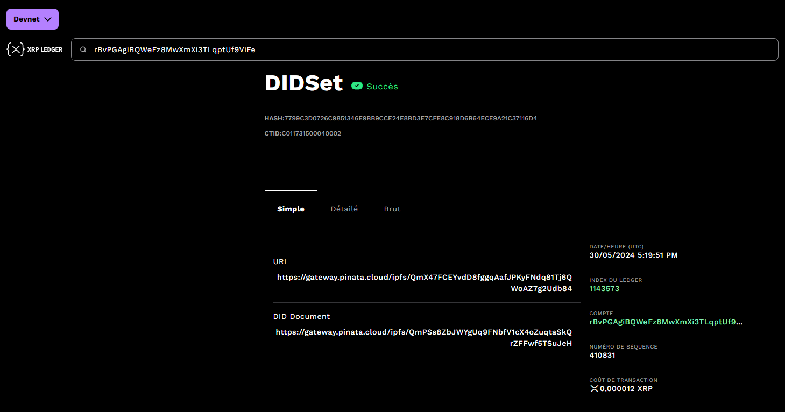

# PawesomeID, your Pet Passport DApp

## Overview

PawesomeID is an innovative decentralized application (DApp) that creates a blockchain-based digital identity for pets. Leveraging the XRPL blockchain and Decentralized Identifiers (DIDs), this project aims to elevate the status of animals in our society by providing them with a secure, transparent, and self-sovereign identity.

This project started during the XRPL Aquarium program Residency in Paris (april to june 2024).

🏆 Winner of the HAKS Hackathon 2024 and Demo Day Jury's Prize 🏆 

## Features

- NextJS and Tailwind CSS landing page and professional dashboard
- XRPL blockchain integration
- Decentralized Identity (DID) implementation (currently on devnet)
- Account abstraction with Kaiju wallet
- Veterinarian-exclusive DID creation for pets
- QR code generation for pet identification

## Technical Stack

- Frontend: Next.js, Tailwind CSS
- Blockchain: XRPL (XRP Ledger)
- Identity: Decentralized Identifiers (DIDs)
- Pinata to Direct Link to DID Document on IPFS
- Wallet: Kaiju (for account abstraction)
- Web3form for the contact section

## How It Works

1. **Veterinarian Authentication**: 
   - Vets can log in using their Gmail account if they don't have a blockchain wallet.
   - The system creates a wallet and an issuerDID for new users.

2. **Pet DID Creation**:
   - Only authenticated veterinarians can create a DID for an animal.
   - A user-friendly form allows vets to input pet information and generate a DID.
  
  

  ```
  {
  "@context": "https://www.w3.org/ns/did/v1",
  "id": "did:xrpl:1:rp5vPZ49XvsqVtuWvaCSgwSbcya1HVpnaZ",
  "controller": "did:xrpl:1:rp5vPZ49XvsqVtuWvaCSgwSbcya1HVpnaZ",
  "verificationMethod": [
    {
      "id": "did:xrpl:1:rp5vPZ49XvsqVtuWvaCSgwSbcya1HVpnaZ#keys-1",
      "type": "EcdsaSecp256k1RecoveryMethod2020",
      "controller": "did:xrpl:1:rp5vPZ49XvsqVtuWvaCSgwSbcya1HVpnaZ",
      "publicKeyHex": "0307248CE83C5301FAE84428730FA46A97F10F75784F633BBCD912C60973D7F2DA"
    }
  ],
  "service": [
    {
      "id": "did:xrpl:1:rp5vPZ49XvsqVtuWvaCSgwSbcya1HVpnaZ#profile",
      "type": "Public Profile",
      "serviceEndpoint": "https://gateway.pinata.cloud/ipfs/Qmf9o4oDRTnA2AoNxLsYtXPRXNU3TxwhzpbZH5HWbdjLZa"
    }
  ]
}
```

3. **Pet ID Card**:
   - Each pet receives a digital ID card containing a QR code.
   - The QR code can be scanned using a mobile app (in development) to verify the pet's identity.

## Future Developments

- Finalization of dynamic DID Document generation
- example on Pinata https://gateway.pinata.cloud/ipfs/QmXt3ACDHNofyKnfPkbDChBhMf919QeZvZrWeLwJoDFTSN
- Integration with "heirloom" DID for veterinarian login
- Biometric authentification
- Mobile application for QR code scanning and verification

## Project Goals

1. Provide a secure and transparent identity system for pets
2. Elevate the status of animals in society through self-sovereign identity
3. Create a user-friendly interface for veterinarians to manage pet identities

## Getting Started

## If you want to test as a veterinarian
#### Clone this repository
Then
```npm install```
and change to ```dev branch``` if you want to test to register a pet as a professional and check it on XRPL devnet.


First, run:

```bash
npm run dev
```

Open [http://localhost:3000](http://localhost:3000) with your browser to see the result.


## Learn More

To learn more about Next.js, take a look at the following resources:

- [Next.js Documentation](https://nextjs.org/docs) - learn about Next.js features and API.
- [Learn Next.js](https://nextjs.org/learn) - an interactive Next.js tutorial.

You can check out [the Next.js GitHub repository](https://github.com/vercel/next.js/) - your feedback and contributions are welcome!


This is a [Next.js](https://nextjs.org/) project bootstrapped with [`create-next-app`](https://github.com/vercel/next.js/tree/canary/packages/create-next-app).

## Deploy on Vercel

Public Landing page without authentification is deployed on Vercel
https://pawesome-id.vercel.app/

The easiest way to deploy your Next.js app is to use the [Vercel Platform](https://vercel.com/new?utm_medium=default-template&filter=next.js&utm_source=create-next-app&utm_campaign=create-next-app-readme) from the creators of Next.js.

Check out our [Next.js deployment documentation](https://nextjs.org/docs/deployment) for more details.


## Contact

Do not hesitate to contact us
ty@bthasystem.io

---

This project is currently a Proof of Concept (POC) and uses the XRPL devnet for DID implementation, as the DID amendment is pending on the main network.