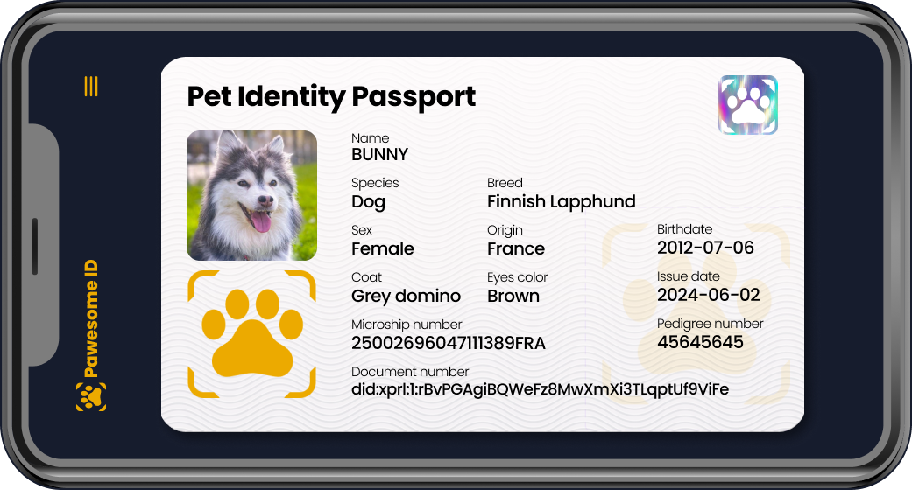
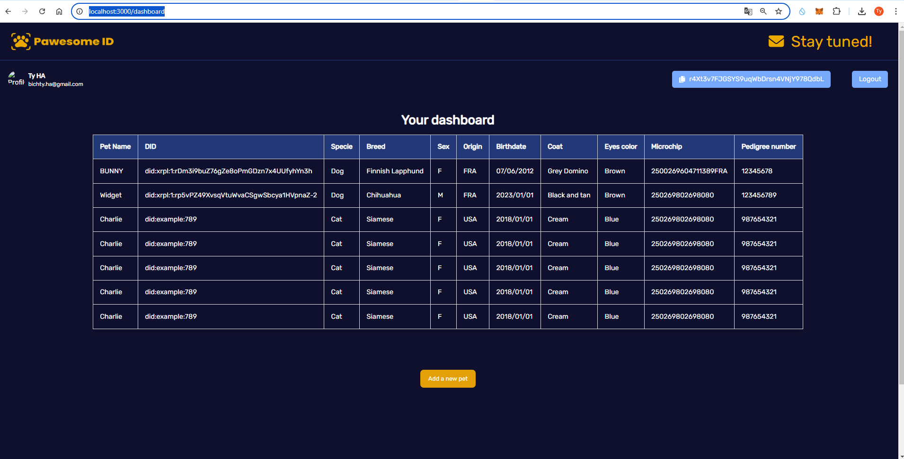

# PawesomeID, your Pet Passport DApp 🐾


##  🏆 Winner of the HAKS Hackathon 2024 and XRPL-Commons Demo Day Jury's Prize 🏆 



## 🌟 Project Overview
#### PROJECT IN PROGRESS

PawesomeID is an innovative decentralized application (DApp) that creates a blockchain-based digital identity for pets. Leveraging the XRPL blockchain and Decentralized Identifiers (DIDs), this project aims to elevate the status of animals in our society by providing them with a secure, transparent, and self-sovereign identity.

This project started during the XRPL-Commons Aquarium program Residency in Paris (april to june 2024).

### The problem
Pet identification and medical record management are often fragmented and insecure, leading to challenges in pet care, lost pets, and potential fraud.

### Our solution
PawesomeID leverages blockchain and Decentralized Identifiers (DIDs) to provide a unified, tamper-proof digital identity for every pet, accessible to owners and authorized veterinarians.

Elevate the status of animals in society through self-sovereign identity

## 🚀 Key Features

- **Blockchain-Powered Pet Passports**: Secure, immutable pet identities on XRPL
- **Veterinarian-Verified Identities**: Only authorized vets can create and update pet DIDs
- **User-Friendly Interface**: Intuitive dashboard for vets and pet owners
- **QR Code Integration**: Quick access to pet information via mobile scanning
- **Account Abstraction**: Seamless onboarding with Kaiju wallet integration

## 🛠 Technical Stack

- **Frontend**: Next.js, Tailwind CSS
- **Blockchain**: XRPL (XRP Ledger)
- **Identity**: Decentralized Identifiers (DIDs)
- **Data Storage**: IPFS via Pinata - example https://gateway.pinata.cloud/ipfs/QmXt3ACDHNofyKnfPkbDChBhMf919QeZvZrWeLwJoDFTSN
- **Wallet**: Kaiju (for account abstraction)
- **Forms**: Web3form for contact section

## 🌈 Impact
- **Enhanced Pet Care**: Seamless access to complete pet medical histories
- **Lost Pet Recovery**: Quick identification and reunion with owners
- **Fraud Prevention**: Tamper-proof records for pedigree and ownership
- **Global Standards**: Pushing for unified, blockchain-based pet identification


## 💡 How It Works

- **Vet Authentication**: Secure login using Gmail (account abstraction) or blockchain wallet
- **Pet DID Creation**: Vets input pet data to generate a unique DID
- **Digital ID Card**: Each pet receives a QR-coded digital passport
- **Verification**: Instant access to pet info via QR code scan

  
  

  ```
  {
  "@context": "https://www.w3.org/ns/did/v1",
  "id": "did:xrpl:1:rp5vPZ49XvsqVtuWvaCSgwSbcya1HVpnaZ",
  "controller": "did:xrpl:1:rp5vPZ49XvsqVtuWvaCSgwSbcya1HVpnaZ",
  "verificationMethod": [
    {
      "id": "did:xrpl:1:rp5vPZ49XvsqVtuWvaCSgwSbcya1HVpnaZ#keys-1",
      "type": "EcdsaSecp256k1RecoveryMethod2020",
      "controller": "did:xrpl:1:rp5vPZ49XvsqVtuWvaCSgwSbcya1HVpnaZ",
      "publicKeyHex": "0307248CE83C5301FAE84428730FA46A97F10F75784F633BBCD912C60973D7F2DA"
    }
  ],
  "service": [
    {
      "id": "did:xrpl:1:rp5vPZ49XvsqVtuWvaCSgwSbcya1HVpnaZ#profile",
      "type": "Public Profile",
      "serviceEndpoint": "https://gateway.pinata.cloud/ipfs/Qmf9o4oDRTnA2AoNxLsYtXPRXNU3TxwhzpbZH5HWbdjLZa"
    }
  ]}

## 🎬 See It in Action
Watch our demo video: PawesomeID in Action https://www.youtube.com/watch?v=YU_JEHt5Jpw

## 🗺 Roadmap

-  Launch mobile app for QR code scanning and verification
- Finalization of dynamic DID Document generation
- Integration with "heirloom" DID for veterinarian login
- Integrate biometric authentication for enhanced security
- Expand to international markets and partner with major pet care brands
- Implement AI-driven health prediction based on blockchain data


## Getting Started

## Test as a veterinarian
#### Clone this repository
Then
```npm install```
and change to ```dev branch``` if you want to test to register a pet as a professional and check it on XRPL devnet.

First, run:

```bash
npm run dev
```

Update the .env with the example
and follow Kaiju doc: https://docs.kaiju3d.com/tutorials/xrpl/google-authentication

Go to login to test kaiju Login
```http://localhost:3000/login```

Then when you can add a pet here:
```http://localhost:3000/mypets/addNewPet```

You will see the dashboard here
```http://localhost:3000/dahsboard```




## Deployed on Vercel

Public Landing page without authentification is deployed on Vercel
https://pawesome-id.vercel.app/

The easiest way to deploy your Next.js app is to use the [Vercel Platform](https://vercel.com/new?utm_medium=default-template&filter=next.js&utm_source=create-next-app&utm_campaign=create-next-app-readme) from the creators of Next.js.

Check out our [Next.js deployment documentation](https://nextjs.org/docs/deployment) for more details.


## 🤝 Get Involved

We're always looking for passionate individuals and organizations to join our mission. Whether you're a developer, veterinarian, or pet enthusiast, there's a place for you in the PawesomeID community.

📧 Contact us: ty@bthasystem.io

🌐 Visit our website: https://pawesome-id.vercel.app/

## 🚀 Help Us Make a Difference

Your support can help us create a safer, more connected world for pets and their humans. Join us in revolutionizing pet care with blockchain technology!

---

This project is currently a Proof of Concept (POC) and uses the XRPL devnet for DID implementation, as the DID amendment is pending on the main network.